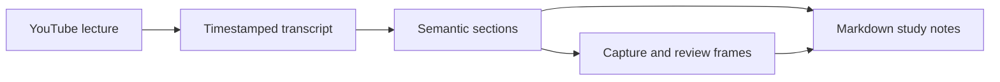

# smart-notes

A Codex skill for turning YouTube lectures into timestamped study notes grounded
in captions and reviewed screenshots.

V1 combines browser acquisition and Codex reasoning with Python helpers for caption
normalization, semantic timeline alignment, frame review records, and Markdown output.
The helpers use Python 3.9+ with no third-party dependencies or API key. They are not
a standalone video-to-summary service: Codex chooses sections, inspects frames, and
writes notes.

## How it works



## Use with Codex

Ask Codex:

> Use the skill at `smart-notes/SKILL.md` to make detailed study notes
> for this YouTube URL, keeping important equations and slides: `<URL>`.

Supported modes: `notes` (default), `detailed`, `exam-review`, `concepts`, and `quick`.
Natural-language requests work too. The skill lives in this project; it has not been
installed globally. Referencing its path works without global installation.

Live acquisition requires a working Browser capability for YouTube transcript UI,
seeking, screenshot capture, and local screenshot export. Saved timestamped text,
SRT, VTT, or segment JSON can also be used. If captions or frames are inaccessible,
the workflow reports the limitation instead of inventing evidence.

See [the skill](smart-notes/SKILL.md),
[browser steps](smart-notes/references/browser-workflow.md), and
[artifact contracts](smart-notes/references/artifacts.md).

## Run the offline example

From this directory:

```sh
python3 smart-notes/scripts/transcript.py smart-notes/examples/transcript.vtt --metadata smart-notes/examples/metadata.json --output output/demo/transcript.json
python3 smart-notes/scripts/timeline.py output/demo/transcript.json --sections smart-notes/examples/sections.json --output output/demo/timeline.json
python3 smart-notes/scripts/frame_selector.py plan output/demo/timeline.json --candidates smart-notes/examples/candidates.json --output output/demo/frame-plan.json
python3 smart-notes/scripts/frame_selector.py review output/demo/frame-plan.json --reviews smart-notes/examples/reviews.json --output output/demo/frames.json
python3 smart-notes/scripts/render_notes.py output/demo/timeline.json --frames output/demo/frames.json --notes smart-notes/examples/notes.json --output output/demo/notes.md
python3 -m unittest discover -s tests -v
```

The example uses invented captions and an explicitly unavailable visual candidate.
It creates `output/demo/notes.md`; a representative rendered copy is included at
[examples/sample-output.md](smart-notes/examples/sample-output.md).
For real captures, keep `notes.md` beside `notes.assets/` when moving or sharing it.
Raw captions remain working evidence and are not reproduced in the final notes.

## V1 boundaries

Semantic segmentation and image selection are agent tasks, not timing heuristics.
The pipeline validates artifact structure and evidence references; it cannot prove
the accuracy of an authored explanation or inspect screenshot legibility itself.
Perceptual frame-change detection, OCR, audio transcription, automatic downloading,
and PDF/HTML/Notion export are deferred.

Local fixtures and image-handling tests validate the Python pipeline. Live YouTube
capture has not been validated in this environment because its browser connection
failed during setup.
